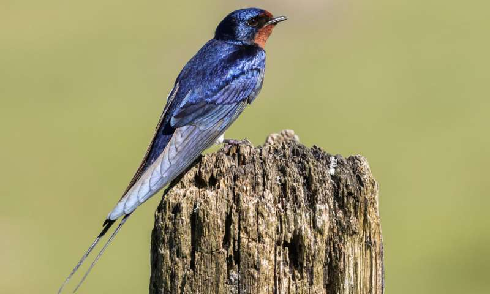

```{r setup, include=FALSE}
knitr::opts_chunk$set(echo = FALSE)
```

 
## Details

* **Source of the article:** 
<https://www.medicalnewstoday.com/articles/326420.php> from Tim Newman. MedicalNewsTime, 09-26-2019.
* **Word count:** 839 

 

## Article 

## North American birds **declined** by 29% since 1970

A recent study concludes that the birds of Canada and the United States have taken a **substantial** hit in the last 49 years. According to the authors, North America's bird populations have decreased by nearly 3 billion birds.

Although species extinctions tend **to hog** the **limelight**, studying reductions in animal numbers is just as important.
Significant changes in population density can have wide ranging effects on ecosystems.

A recent study **attempts** to understand how bird populations are changing across North America. Some scientists use **wild** bird populations as an indicator of the general health of an ecosystem, so any changes could be significant for the natural world at large.
Due to their **sheer** numbers, small **stature**, and **flighty habits**, assessing the size of bird populations is challenging.

However, a group of scientists recently took on this **task**.

### Extensive **data**, **bleak** conclusions

Researchers from several institutions in the U.S. and Canada, including the American
Bird Conservancy, the Bird Conservancy of the Rockies, the Cornell Laboratory of Ornithology, and Environment and Climate Change Canada, joined forces for the study.
To create a clear picture of the state of North American birdlife,
the scientists combined data from various independent sources.
For **instance**, some data came from almost 50 years of monitoring efforts from the ground. The team also took data from 143 Next Generation Weather Radar (NEXRAD)
stations that detect migrating birds in the air.
The authors published their **sobering** analysis in the journal Science.

They conclude that the number of birds in North America has **decreased** by nearly 3 billion, a decline of 29%. They also note that 90%
of these losses affected just 12 bird families, including **warblers**, **sparrows**, **finches**,and **swallows**.

These birds are common species that experts do
not consider to be at risk. They **play pivotal roles** in combating **pests** and dispersing **seeds**
.
"Multiple, independent lines of **evidence** show a massive reduction in
the abundance of birds. We expected to see continuing declines of **threatened** species. But for the first time, the results also showed **pervasive** losses **among** common birds across all habitats, including **backyard birds**."

### Big losses, small wins

Species that have **taken notable hits** include birds that live in **grasslands**,
the numbers of which decreased by 53%, equating to about 720
million birds. Also, **shorebirds**, which have **struggled** in the past, lost more than one- third of their numbers.
   
The researchers used NEXRAD data to assess the numbers of birds taking part in migrations. These data, which covered a 10-year period, **uncovered** a
14% decline in bird numbers.

Co-author Peter Marra explains how the steep decline that they measured in birds mirrors that affecting other animals, including insects and amphibians. He is concerned and calls for action, pointing out that birds play a pivotal role in
the ecosystems that we "depend on for our own health and **livelihoods.**"
Beyond health and wealth, on a more emotional note, Marra says that "people all over the world cherish birds in their own right. Can you imagine a world without birdsong?"

## Why are birds declining?

The researchers behind this particular project did not **set out** to understand why bird populations are **dwindling**. However, they note that the decline in North America is **occurring** in line with a global decrease in bird populations. This fact **hints** at an overarching set of factors that negatively influence both **breeding** and survival.
One of the major players is likely to be habitat loss due to expanding **urban sprawl** and agriculture. Other factors that might be playing a role include urban domestic cat populations, collisions with glass structures and buildings, and the increasing use of pesticides, which kill the insects that birds **rely on** for food.

Despite the **gloomy** conclusions, co-author Michael Parr remains hopeful and believes that the issue is rectifiable. He explains that "there are so many ways to
help save birds. Some require policy decisions, such as **strengthening** the Migratory Bird Treaty Act . We can also work to ban harmful pesticides and properly fund effective bird conservation programs."

There are also ways in which the public can get involved. Parr says that "each of us can make a difference with everyday actions that together can save the lives of millions of birds — actions like making windows safer for birds, keeping cats indoors,and protecting habitat."

Although most of the study findings are negative, some species are making a **recovery**. For instance, **waterfowl**, such as **geese** and swans, have slowly increased in number over the last few decades. This comeback is thanks to investment in conservation and the protection and rebuilding of **wetlands**.
Some raptors, including the bald eagle, have also recovered since the 1970s, which is **partly** due to banning the pesticide DDT and increasing protection through endangered species legislation.

Although the findings provide little to celebrate, the authors hope that they will **stir up** public interest and inspire action.

"What our birds need now is a historic, hemispheric effort that unites people and organizations with one common goal: bringing our birds back."

## Vocabulary

| Word from the text  | Synonym/explanation in English | French translation |
| ------------------- | ------------------------------ | ------------------ |
| to decline          | to become smaller or worse     | Décliner, baisser  |
| substantial         | large in amount or value       | substantiel/-elle  |
| hog                 | To take or use something all for oneself; to not allow others to have or use something.                              | Tout prendre pour soi
| limelight           | The focus of public attention  | le feu des projecteurs |
| attempt             | Make an effort to achieve or complete (something difficult) | tentative
| wild                | living or growing in the natural environment; not domesticated or cultivated. | sauvage 
| sheer | Words used to describe amounts or quantities | important, grand |
| stature | height | Taille
| flighty | fickle, changeable | changeant, inconstant |
| task | A piece of work to be done / duty | tâche 
| data | Facts and statistics collected together for reference or analysis. | données |
| bleak | not hopeful or encouraging | sombre, morne | 
| instance | An example | exemple
| sobering | Creating a more serious, sensible, or solemn mood. | qui donne à réfléchir | 
| decrease | to become or make smaller | décroître |
| warblers | a small bird that lives in trees and sings | fauvettes |
| sparrows | a small, grey-brown bird that is especially common in towns | moineaux |
| finches | any of various types of small singing bird with a short, wide, pointed beak | pinsons |
| swallows | a small bird with pointed wings and a tail with two points that flies quickly and catches insects to eat as it flies | hirondelles | 
| play pivotal role | play a crucial role | jouer un rôle crucial |
| pests | an insect or small animal that is harmful or damages crops | nuisibles | 
| seeds | the unit of reproduction of a flowering plant. | semence |
| evidence | proof | preuve | 
| threatened | cause (someone or something) to be vulnerable or at risk; endanger | menacer |
| pervasive | invasive | envahissant |
| among | in the middle of or surrounded by other things | parmi |
| backyard | a small space surrounded by walls at the back of a house | une cour |
| take notable hits | suffer | souffrir |
| grassland | a large area of land covered with grass | prairie |
| shorebirds | bird that frequents the shore | oiseaux de rivage |
| struggle | to experience difficulty and make a very great effort in order to do something | lutter |
| uncover | to discover | découvrir |
| livelihoods | a means of securing the necessities of life | subsistance |
| set out | to give the details of or explain something | expliquer | 
| dwingling | to become smaller in size or amount, or fewer in number | diminuer |
| occur | happen; take place | se produire |
| hint | suggest or indicate something indirectly or covertly, insinuate | sous-entendre, insinuer |
|overarching | Comprehensive or all-embracing. | global, complet |
| breeding | reproducing, procreation | reproduction |
| urban sprawl | the uncontrolled expansion of urban areas | l'étalement urbain |
| rely on | depend on with full trust or confidence | dépendre de |
| gloomy | unhappy and without hope | lugubre, sombre | 
| strengthening | to make something stronger or more effective | renforcement |
| recovery | the process of becoming well again after an illness or injury | récupération |
| waterfowl | any bird that spends much of its life on or around a river or lake | oiseaux aquatiques |
| geese | plural of goose. A large water bird similar to a duck | oies |
| wetland | a large area of land covered with swamp or marsh | zone humide |
| partly | not completely | en partie |
| stir up | to spark | susciter | 


## Analysis table about the study

|                              |                                                                     |
| ---------------------------- | ------------------------------------------------------------------- |
| Researchers                  | Researchers from different institutions,They are scientist.(the American Bird Conservancy, the Bird Conservancy of the Rockies, the Cornell Laboratory of Ornithology, and Environment and Climate Change Canada) --> Adam Smith, Michael Parr, Peter Marra, Ken Rosenberg, and more. |
| Published in?                | 26 September 2019                                                       |
| General topic?               |  The big decline of birds in North America, based on studies spread over almost 50 years.                      |
| Procedure/what was examined? | Reasearchers from different institutions did the study (Canada and US). --> Analysis of the birds from the ground. --> Use of weather radars to detect migratory birds. --> Share of data independent of each other. --> Data spread over almost 50years. --> Observation of the decline of the common birds. --> Explanation of this loss. (not exactly sure yet) --> Solutions to solve / mitigate the problem.
| Conclusions/discovery?       |  A decline of 29% (3 billion birds). 90% of these birds are common species.     |
| Remaining questions?         | They are not really sure about the exact cause of the decline of birds. Is it just cats, pesticides, buildings or urban sprawl and agriculture? |

## Sources

<https://www.lexico.com/en> , <https://dictionary.cambridge.org/fr/> , <https://www.linguee.fr/francais-anglais> , image :<https://www.google.be/url?sa=i&source=images&cd=&cad=rja&uact=8&ved=2ahUKEwjlxLjE9aPlAhUPJlAKHUrBB3EQjRx6BAgBEAQ&url=https%3A%2F%2Fphys.org%2Fnews%2F2019-09-birds-decline-lake-constance.html&psig=AOvVaw1lRl4Nh5AqrmAgaZ3_hVMl&ust=1571422650981906>
