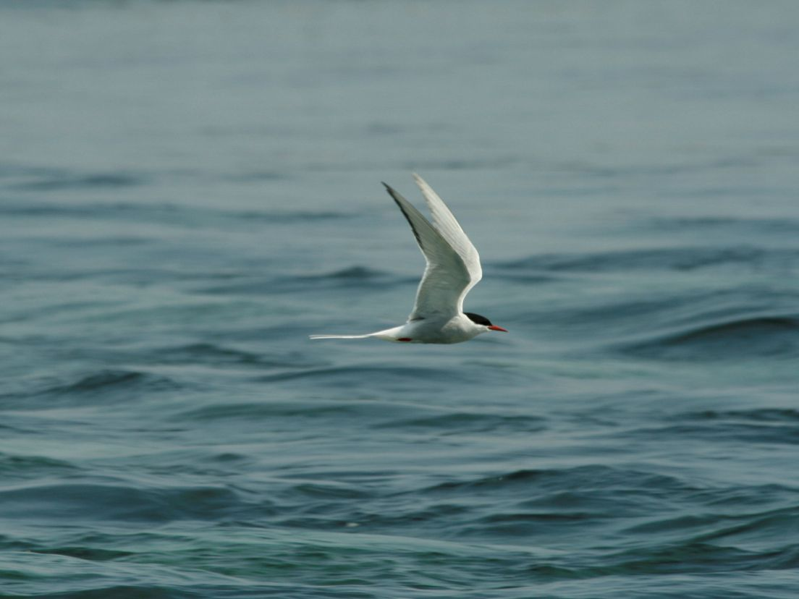

```{r setup, include=FALSE}
knitr::opts_chunk$set(echo = FALSE)
```

## Details

* **Source of the article:** <https://time.com/5697804/climate-change-birds/> Time, 10-10-2019.
* **Word count:** 605




## Vocabulary

| Word from the text  | Synonym/explanation in English | French translation |
| ------------------- | ------------------------------ | ------------------ |
| To shape up | To develop, to progress | Faconner, concevoir |
| Utter | Total, complete | Total |
| Sanderling |
| Red-header woodpeckers | Bird that uses its strong beak to make holes in tree trunks in order to find insects to eat | Pics à tête rouge |
| Owl | Bird with a flat face and large eyes that hunts small mammals at night | Chouette |
| Assessment | The act of judging or deciding the amount, value, quality, or importance of something, or the judgment or decision that is made |Evaluation |
| To depict | To represent or show something in a picture or story | Représenter, illuster |
| Dire | Very serious or extreme | Désastreux, grave | 
| Avian | Of or relating to birds | Aviaire |
| To carry out | To do or complete something/ to accomplish | Réaliser, effectuer |
| Commitment | A promise or firm decision to do something | Engagement |
| Come on the heels of | Following close behind or soon after someone or something | Vient juste après, fait suite à |
| Worsening | Becoming worse | Aggravation | 
| Coal mine | The deep hole or system of holes under the ground from which coal is removed |Mine de charbon |
| Broader | Very wide | Plus large |
| To squeez | To press something firmly | Comprimer, presser |
| Ongoing | Continuing to exist or develop | En cours |
| To erase | To remove something | Effacer |
| To revive | To come or bring something back to life | Relancer |
| Solace | Help and comfort when you are feeling sad or worried | Réconfort |
| To figure sb/sth out | To understand or solve something | Déterminer |
| Loon | Large North American bird that eats fish | Plongeon huard | 


## Analysis table about the study

|                              |                                                                     |
| ---------------------------- | ------------------------------------------------------------------- |
| Researchers                  | -> *Brooke Bateman*: climate scientist for the National Audubon Society. + -> *Mike Parr*: president of the American Bird Conservancy. + -> *Ken Rosenberg*: scientist |
| Published in?                | 10 October 2019 |
| General Topic                | One of the causes of bird declines in North America is global warming. |
| Procedure/what was examined? | K.Rosenberg has released an alarming report regarding the loss of 3 million birds in North America. --> Researchers B.Baterman & M.Parr have done a study linking global warming to these losses. --> Output of a report predicts the loss of 600 birds (400 species) if the temperature increases from 1.5 to 3 degrees celcius. --> Global warming makes the situation worse. --> Explanation of the gravity of the subject. --> We can still save the situation by making great efforts. --> If nothing is done to reduce the warming, the birds will disappear. |
| Conclusions/discovery?       | Global warming threatens two-thirds of the birds of North America (about 600 species). There is a big risk of extinction. |
| Remaining questions?         | If nobody settles the situation, will global warming lead to total extinction of common birds? |


## Sources

<https://www.lexico.com/en> , <https://dictionary.cambridge.org/fr/> , <https://www.linguee.fr/francais-anglais> , image: <https://www.haaretz.com/science-and-health/MAGAZINE-sheer-speed-of-global-warming-is-decimating-birds-say-scientists-1.6302093>
