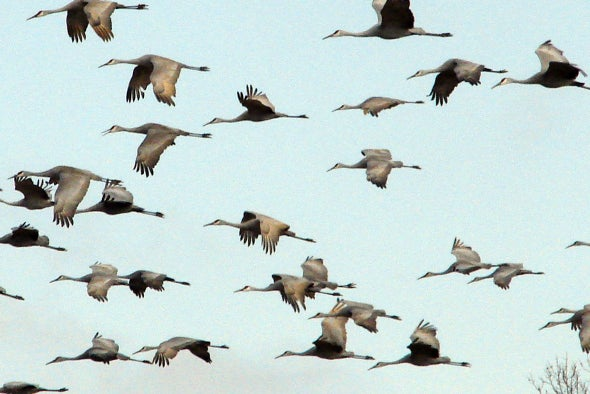

```{r setup, include=FALSE}
knitr::opts_chunk$set(echo = FALSE)
```

## Details

* **Source of the article:** <https://time.com/5697804/climate-change-birds/> Time, 10-10-2019.
* **Word count:** 605




## Vocabulary

| Word from the text  | Synonym/explanation in English | French translation |
| ------------------- | ------------------------------ | ------------------ |
|

## Analysis table about the study

|                              |                                                                     |
| ---------------------------- | ------------------------------------------------------------------- |
| Researchers                  |


## Sources
