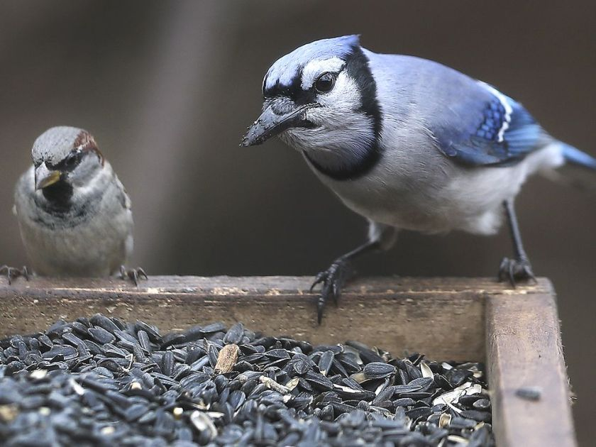

```{r setup, include=FALSE}
knitr::opts_chunk$set(echo = FALSE)
```

## Details

* **Source of the article:** 
<https://windsorstar.com/news/local-news/shocking-bird-decline-makes-winter-bird-feeder-watching-key> Windsor Star, 11-21-2019.
* **Word count:** 477



## Vocabulary

| Word from the text  | Synonym/explanation in English | French translation |
| ------------------- | ------------------------------ | ------------------ |
| Feeder | A container filled with food for birds or mammals | Mangeoire |
| Eyeopener | Something that surprises you and teaches you new facts about life, people,... | Révélation |
| Plummet | To fall very quickly and suddenly | Chuter |
| Coverage | The reporting of a particular important event or subject | Couverture |
| Citizen | A legally recognized subject or national of a state or commonwealth, either native or naturalized | Citoyen |
| Tenfold | Ten times as big or as much | Multiplier par dix |
| Valuable | Worth a lot of money | Précieux |
| Decal | Picture or design printed on special paper, that can be put onto another surface, such as metal or glass | Autocollant | 
| Dot | A small round mark or spot | Point | 
| Pattern | A repeated decorative design | Motif, modèle |
| To obstruct | To block up | Obstruer |


## Analysis table about the study

|                              |                                                                     |
| ---------------------------- | ------------------------------------------------------------------- |
| Researchers                  | --> *Kerrie Wilcox*: Researcher who works for the *Project FeederWatch* in Canada. + --> *Tom Preney*: Biodiversity coordinator of K.Wilcox. |
| Published in?                | 21 November 2019 |
| General Topic                | In view of the report on the huge decline of birds since 1970, citizens can help birds by feeding them during the winter with **feeders**. This idea can both help birds through the winter but also help scientists by observing them, counting them, etc. |
| Procedure/what was examined? | |
| Conclusions/discovery?       | There is an **increase** in the number of people who place feeders in their gardens and report information on the birds they observe. |
| Remaining questions?         | / |

## Sources

<https://www.lexico.com/en> , <https://dictionary.cambridge.org/fr/> , <https://www.linguee.fr/francais-anglais> , image: <https://www.nwf.org/Magazines/National-Wildlife/2019/Feb-Mar/Gardening/Keep-Bird-Feeders-Clean>
