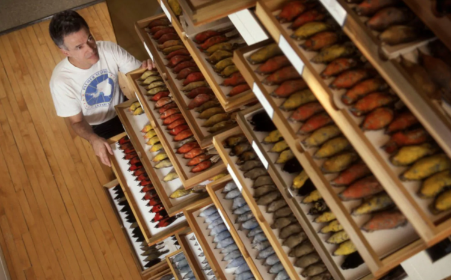

```{r setup, include=FALSE}
knitr::opts_chunk$set(echo = FALSE)
```

## Details

* **Source of the article:** 
<https://www.irinsider.org/environment-1/2019/12/7/bird-bodies-are-morphing-in-north-america> by Jolie Radunich , 12-07-2019.
* **Word count:** 361



## Vocabulary

| Word from the text  | Synonym/explanation in English | French translation |
| ------------------- | ------------------------------ | ------------------ |
| To morph | To gradually change, or change someone or something, from one thing to another | Se transformer, se métamorphoser |
| To shrink | Becoming smaller in size or amount | Rétrécir |
| To prompt | Bring about | Inciter |
| Bountiful | Large in quantity; abundant | Abondant |
| Sample | A small part or quantity intended to show what the whole is like | Echantillon |
| Wasted | That is not used effectively | Gaspillé |
| Breeding | Reproducion | Reproduction |
| Husky |  Big and strong | Costaud |
| Lean | Thin | mince, maigre |
| Findings | Conclusion | Conclusions |
| Spell | Write or name the letters that form (a word) in correct sequence | Epeler |
| To back | Give financial, material, or moral support to | Soutenir |
| To pose | Present or constitute (a problem or danger) | Présenter |
| Supply | Stock, reserve | Approvisionnement |

## Analysis table about the study

|                              |                                                                     |
| ---------------------------- | ------------------------------------------------------------------- |
| Researchers                  | --> *Jolie Radunich*:

## Sources

<https://www.lexico.com/en> , <https://dictionary.cambridge.org/fr/> , <https://www.linguee.fr/francais-anglais> , image: <https://www.discovermagazine.com/planet-earth/climate-change-could-be-making-birds-smaller>
