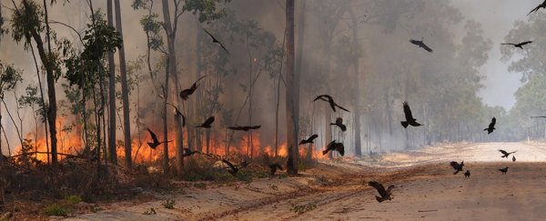

```{r setup, include=FALSE}
knitr::opts_chunk$set(echo = FALSE)
```

## Details

* **Source of the article:** 
<https://cornellsun.com/2020/02/06/in-the-midst-of-australias-bushfires-bird-population-plunges/> by Aditya Ramachandrababu , 02-06-2020.
* **Word count:** 659



## Vocabulary

| Word from the text  | Synonym/explanation in English | French translation |
| ------------------- | ------------------------------ | ------------------ |
| To plunge | To dive | Plonger qqch/qqn |
| Inferno | A large fire that is dangerously out of control | Brasier |
| Breeding | Reproduce | Reproduction |
| To sweep | To brush | Balayer |
| Grapple | Wrestle | Lutter |
| Detrimental | Harmful | Néfaste |
| Blaze | Fire | Flamme |
| Nest | A structure or place made or chosen by a bird for laying eggs | Nid |
| To sustain | To comfort | Soutenir qqch/qqn |
| Edge | Border | Bordure |
| Spells doom | To lead to the failure or end of something | Condamner |
| Merely | Just, only | Simplement |
| Choke | to have severe difficulty in breathing because of a constricted or obstructed throat or a lack of air | Ettoufer |
| Ripple | Wave | Vague |
| Outage | A period when a power supply or other service is not available | Panne, coupure |
| To acknowledge | To admit | Reconnaître |
| To gush | (liquid) flow out of something | Jaillir |
| Wound | Injury | Plaie, blessure |
| To dismay | To be alarm, shock | Consterner | 

## Analysis table about the study

|                              |                                                                     |
| ---------------------------- | ------------------------------------------------------------------- |
| Researchers                  |

## Sources

<https://www.lexico.com/en> , <https://dictionary.cambridge.org/fr/> , <https://www.linguee.fr/francais-anglais> , image: <https://www.sciencealert.com/birds-intentionally-set-prey-ablaze-rewriting-history-fire-use-firehawk-raptors>
