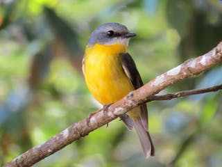
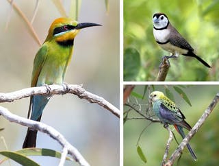

```{r setup, include=FALSE}
knitr::opts_chunk$set(echo = FALSE)
```

## Details

* **Source of the article:** 
<https://theconversation.com/most-native-bird-species-are-losing-their-homes-even-the-ones-you-see-every-day-123007> from Jeremy Simmonds, Alvaro Salazar, James Watson & Martine Maron, 28-10-2019.
* **Word count:** 824



## Vocabulary

| Word from the text  | Synonym/explanation in English | French translation |
| ------------------- | ------------------------------ | ------------------ |
| Emphasis | Special importance, value, or prominence given to something | Accentuation |
| Least concern | Species of minor concern | Espèce de préoccupation mineure |
| Chip away | Gradually and relentlessly make something smaller or weaker | Gruger, s'effriter |
| Intrinsic | Belonging naturally; essential | Intrinsèque |
| Be under threat of sth | To be in a situation where people are threatening you| Etre sous la menace | 
| Brighter | Full of light, shining | Lumineux, plus clair |
| Tract | An area of land, typically a large one | Etendue |
| Remain | Continue to exist | Demeurer, rester |
| Notwithstanding | In spite of / Despite | Malgré, en dépit de |
| Removal | The action of taking away or abolishing something | Suppression, elimination |
| Parrot | Tropical bird with a curved beak, often kept as a pet and trained to copy the human voice | Perroquet |
| Trend | A general direction in which something is developing or changing / Movement | Tendance |
| Downward | Moving or leading towards a lower place or level | A la baisse |
| Rainbow bee-eater | A migratory bee-eater which has multicoloured plumage and a black eyestripe | Guêpier arc-en-ciel |
| Double-barred finch | Bird found in dry savannah, tropical dry grassland and shrubland habitats in northern and eastern Australia | Diamant de Bicheno |
| Pale-headed rosella | It is a moderate-size parrot with a pale yellow head, predominantly white cheeks, scalloped black and gold back and pale blue underparts | Perruche à tête pâle |

*Rainbow bee-eater*, *Double-barred finch*, *Pale-headed rosella*

|   |  |  |
| ------------------- | ------------------------------ | ------------------ |
| Robin | Small insectivorous passerine bird | Rouge-gorge |
| Fence | Structure that divides two areas of land, similar to a wall but made of wood or wire and supported with posts | Clôture | 
| Dashing | Attractive in a confident, exciting, and stylish way | Fringant, pimpant |
| Treetops | The uppermost part of a tree | Cime des arbres |
| Suburban | Relating to a suburb: An outlying district of a city, especially a residential one | Banlieue |
| Creek | Narrow area of water that flows into the land from the sea, a lake, etc | Ruisseau |
| Aim | Result that your plans or actions are intended to achieve / Goal, ambition | Objectif |
| To slide | Move smoothly along a surface | Glisser |
| Endangerment | The action of putting someone or something at risk or in danger | Mise en danger |

## Analysis table about the study

|                              |                                                                     |
| ---------------------------- | ------------------------------------------------------------------- |
| Researchers                  | -> *Jeremy Simmonds*: postdoctoral research fellow in conservation science, at the University of Queensland + -> *Alvaro Salazar*: postdoctoral research fellow at the University of Queensland + -> *James Watson*: professor at the University of Queensland + -> *Martine Maron*: professor of environmental management at the University of Queensland.
| Published in?                | 28 October 2019 |
| General topic?               | Native birds from Australia are disappearing because of the urbanisation, the destruction of the wildlife. --> Because of the **habitat loss**. |
| Procedure/what was examined? | **Urbanization** and **urban development** destroy vegetation and many natural habitats. --> These destructions affect species (**extinction**) --> Scientists have developed a **loss index** to indicate how habitat loss affects Australian birds --> Many birds not recognized as being in danger have **disappeared** --> Scientists have noticed that even removing *one hectare* has a big negative impact on birds. --> This *loss index* allow them to compare different groups in front of habitat loss --> They used the **Living Planet Index** to compare these lost around the world. --> Big problem in the health of ecosystem. --> Common species are in big **danger**. --> We can not wait, otherwise these species will disappear under our eyes. |
| Conclusions/discovery?       | Across Australia, **+60%** of 262 native birds have lost their habitat according to the *Loss Index*. They recorded that **52%** of birds in this country have declined since 1985 to 2015. + *The Living Planet Index* noticed that that more than **4000 birds** have decreased by more than half since 1970. **Parrots** are the most struck. --> Big link between habitat loss and decrease of population of birds. |
| Remaining questions?         | / |

## Sources

<https://www.lexico.com/en> , <https://dictionary.cambridge.org/fr/> , <https://www.linguee.fr/francais-anglais> , images: <https://theconversation.com/most-native-bird-species-are-losing-their-homes-even-the-ones-you-see-every-day-123007>


| 
