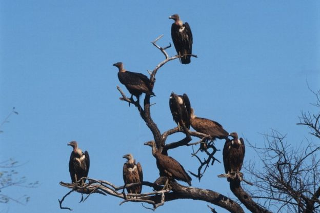

```{r setup, include=FALSE}
knitr::opts_chunk$set(echo = FALSE)
```

## Details

* **Source of the article:** 
<https://www.bbc.com/news/world-asia-india-51541741> BBC , 02-18-2020.
* **Word count:** 501



## Vocabulary

| Word from the text  | Synonym/explanation in English | French translation |
| ------------------- | ------------------------------ | ------------------ |
| Shore | The land along the edge of a sea, lake | Rive, rivage |
| Sighting | An occasion when you see something or someone, especially something that is rare | Observation, repérage |
| Crowdsourcing | Using the creativity, intelligence and know-how of a large number of people, in subcontracting, to carry out certain tasks traditionally performed by an employee or an entrepreneur | Production participative | 
| Within | Inside (something) | Dans, au sein de | 
| Bustard | Bird of the Otididae family | Outarde |
| Hinder | Make it difficult for (someone) to do something or for (something) to happen | Entraver qqch/qqn |

## Analysis table about the study

|                              |                                                                     |
| ---------------------------- | ------------------------------------------------------------------- |
| Researchers                  | -> *MD Madhusudan*, co-founder of Nature Conservation Foundation + -> *eBird*, a global crowdsourced database |
| Published in?                | 18 February 2020 | 
| General Topic                | The decline of some bird species in India as well as the increase of other species |
| Procedure/what was examined? | Study conducted by bird watchers (15,000) amateurs (867 birds) -> *decline* of somes species ( eagles, vultures, warblers and migrating shorebirds. ) ->  *increase* of other species (peafowl, the national bird)
| Conclusions/discovery?       |
| Remaining questions?         | / |


## Sources

<https://www.lexico.com/en> , <https://dictionary.cambridge.org/fr/> , <https://www.linguee.fr/francais-anglais>
