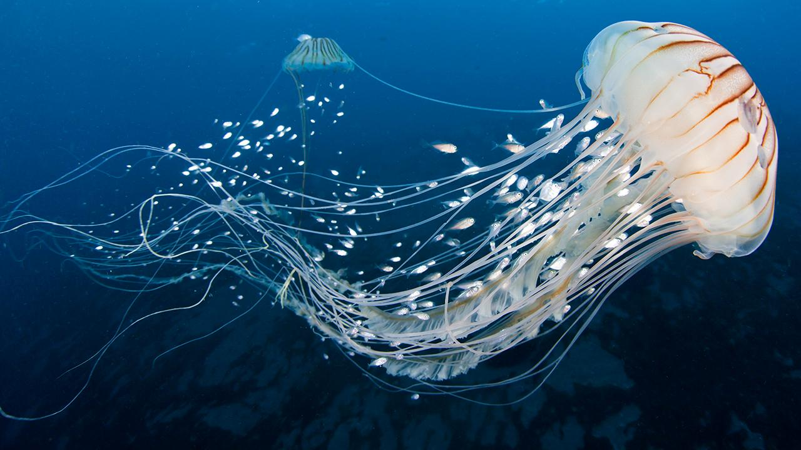

**Name:** Olivieri Maria-Louisa

**Teacher:** Ingrid Van Lancker 

**Group:** Group 2

**Class:** BAC2 Biology

**Academic year:** 2019-2020

**Topic:** Birds population

## Small introduction

I am a student in Biology at Umons University in Belgium. This blog serves me as a platform to edit my portfolio, which is about the *" birds population"*. You will also find my activity journal about my daily life in English. 

### I am passionate about...

*Jellyfish*

 

*Raptors*

*Cephalopods*

|                              |                                                                     |
| ---------------------------- | ------------------------------------------------------------------- |
| Why biology?                  | I have always been passionate about life and the living. Animals,the way our body works, the evolution of our Earth fascinate me. I study biology to become a marine zoologist                       |
| Why did I chose this topic?                | The birds were the first animals to which I paid attention. I have always observed them in my garden. When I heard about this decline I wanted to work on it to better understand the situation and maybe even find a solution because it is true that even if the study is based in North America, I  have myself observed a decrease in common birds in my neighborhood as the years go by.                                                       |

